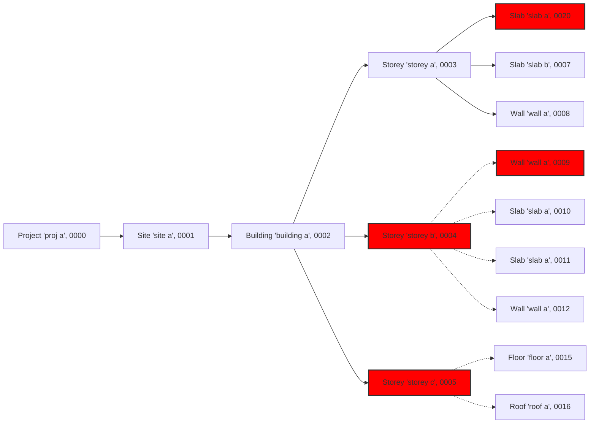

```mermaid
graph LR;
    style A fill:#ff0000,stroke:#333,stroke-width:2px
    style A2 fill:#ff0000,stroke:#333,stroke-width:2px
    style E fill:#ff0000,stroke:#333,stroke-width:2px
    style F fill:#ff0000,stroke:#333,stroke-width:2px
    style L fill:#ff0000,stroke:#333,stroke-width:2px
    style Q fill:#ff0000,stroke:#333,stroke-width:2px
    style P fill:#e6e6e6,stroke:#333,stroke-width:2px
    style Q fill:#e6e6e6,stroke:#333,stroke-width:2px

    A[IfcProject 'proj a', 0000]
    A2[IfcProject 'proj false', 9999]
    B[Site 'site a', 0001]
    C[Building 'building a', 0002]
    D[Storey 'storey a', 0003]
    E[Storey 'storey false_name', 0004]
    F[Storey 'storey c', 9998]
    H[Slab 'slab b', 0007]
    I[Wall 'wall a', 0008]
    K[Slab 'slab a', 0010]
    L[Slab 'slab false_name', 0011]
    M[Wall 'wall a', 0012]
    P[Floor 'floor a', 0015]
    Q[Roof 'roof a', 9997]

    A --> B
    B --> C
    C --> D
    C --> E
    C --> F
    D --> G
    D --> H
    D --> I
    E --> K
    E --> L
    E --> M
    F -.- P
    F -.- Q